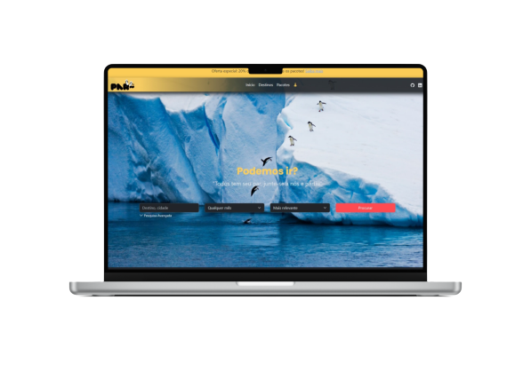

"Todos tem seu par, junte-se a nós e . . ." 

<h1 align="center">

</h1>

  <a href="#about"> About </a>&nbsp;&nbsp;&nbsp;&#124;&nbsp;&nbsp;&nbsp;
  <a href="#technologies"> Tech </a>&nbsp;&nbsp;&nbsp;&#124;&nbsp;&nbsp;&nbsp;
  <a href="#screenshots"> Screenshots </a>&nbsp;&nbsp;&nbsp;&#124;&nbsp;&nbsp;&nbsp;
  <a href="#deploy"> Deploy </a>&nbsp;&nbsp;&nbsp;&#124;&nbsp;&nbsp;&nbsp;
  <a href="#code-of-conduct"> Code of Conduct </a>

 

# The Repository

This repository is where I develop the [Partiu&trade;](https://partiu-viagens.vercel.app/index.html) product together with Recode Pro 2023. Not only working on code and issues here, but also publishing the entire roadmap, monthly iteration plans, and endgame plans. This source code is available to everyone under the standard [MIT license](https://github.com/Fiigueiredo/partiu/blob/main/LICENSE).

 

# About

  

"Partiu&trade; is an example of a travel agency that is in development and updates throughout the Full stack Developer Bootcamp at Recode Pro 2023. Where the goal is to get students to apply their learning, as well as feed their portfolio!"

 

# Technologies

In this activity, I am using concepts of algorithms in pseudocode (Troubleshooting using portugol), HTML , CSS  e BOOTSTRAP  for the construction of a <strong>travel agency </strong>model.

- <em>Using Pseudocode Language</em>:  
  > Using structured programming concepts, create in pseudocode a 'menu' to simulate a registration for a travel agency with the following functions:
  >
  > Test our algorithm! [Click here](src/assets/data/partiu.alg)
  
  - Customer Registration;
  - Destination Registration;
  - Customer Inquiry;
  - Destination Query;

- <em>Using WEB language</em>: 

  - &#x2611; Create the page: Home;
  - &#x2611; Create the page: Destination;
  - &#x2611; Create the page: Promotions;
  - &#x2611; Create the page: Contact;
  - &#x2611; Pages must be responsive or adaptable;
  - &#x2611; Make the formatting according to the chosen color palette;

 

# Screenshots

  

 

# Deploy
>
> Visit our page! [Click here](https://partiu-viagens.vercel.app/index.html)

 

# Code of Conduct

This project has adopted the [Microsoft Open Source Code of Conduct](https://opensource.microsoft.com/codeofconduct/). For more information see the [Code of Conduct FAQ](https://opensource.microsoft.com/codeofconduct/faq/) or contact [opencode@microsoft.com](mailto:opencode@microsoft.com) with any additional questions or comments.

 

# License

Copyright &copy; Partiu Travel Agency. All rights reserved.
Licensed under the [MIT](https://github.com/Fiigueiredo/partiu/blob/main/LICENSE)
license.

 

------------

 Developed by Levi Figueiredo &nbsp;&#124&nbsp; Recode Pro 2023 

<!--
&#x2610; Desmarcado
&#x2611; Marcado com visto
&#x2612; Marcado com x
-->